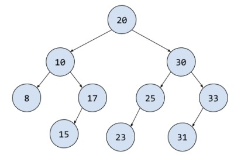
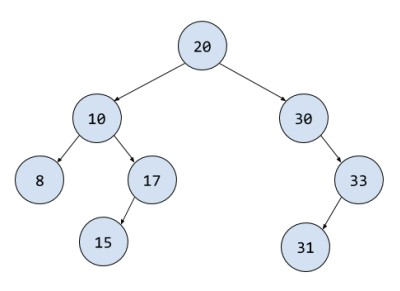
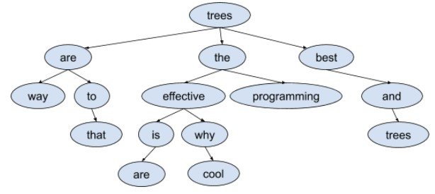

**Задача 0.** Преговорете задачите от [семинара за двойносвързан списък](../Data%20Structures/List/List/).  
<br />
  
---

**Задача 1.** Напишете програма, която прочита от текстов файл двоично дърво с елементи цели числа. Форматът на данните е следния:  
- На първия ред във файла са записани две числа - общият брой елементи в дървото N и височината на дървото H.  
- След това следват H реда, всеки съдържащ елементите от съответното ниво на дървото.  
- За наличните елементи имате числа, а за липсващите има знак *.  
- Всеки ред завършва задължително с число.  
- Между елементите има произволен брой интервали.  
  
Приемете, че форматът на данните във файла е коректен. След прочитане на дървото проверете дали то е валидно двоично дърво за търсене. Ако това е така трябва да прочетете от клавиатурата цяло число K (0 <= K < N) и да изведете на екрана K-тото по големина число от дървото.  
*Примери:*
|Вход:|Изход:|
|---|---|
|10 4|BST|
|20|17|
|10 30|
|8 17 25 33|
|* * 15 * 23 * 31|
|3|  


|Вход:|Изход:|
|---|---|
|8 4|BST|
|20|31|
|10 30|
|8 17 * 33|
|* *  15 *  * *  31|
|6|  

<br />
  
---

**Задача 2.** Даден е вектор v от цели числа. Казваме, че двоичното дърво с положителни числа по върховете t представя v при следните условия:

    * v е празният вектор и t е празното дърво; или
    * ако v = v[0],…,v[k-1], a m = ⌊k / 2⌋ (долна цяла част),
      то коренът на t съдържа числото v[m], лявото поддърво на t
      представя вектора v[0],…,v[m-1], а дясното поддърво на t
      представя вектора v[m+1],…,v[k-1].

  *Забележка: ако k = 2, то десния подвектор считаме за празен.*

  Нека е даден следният шаблон Node, дефиниран в node.h.

  **а)** Да се реализира функция, която построява дърво, представящо
  вектора v, и връща указател към корена му.

  *Упътване: Ако v е вектор, то с помощта на следния конструктор
  `std::vector<unsigned> L(v.begin(), v.begin() + count)` ще получите
  първите count елемента от v,
  а с `std::vector<unsigned> R (v.begin() + start, v.end())`, ще
  получите суфикса на v, започващ от елемента с индекс start.*

  *Пример:*
  ```c++
  std::vector<unsigned> v { 1, 2, 3, 4, 5, 6 };
  std::vector<unsigned> L ( v.begin()    , v.begin() + 3 );
  std::vector<unsigned> R ( v.begin() + 4, v.end()       );
  // Тогава L е векторът 1, 2, 3, а R е векторът 5, 6.
  ```

 **б)** Да се реализира функция, която връща вектор, съставен от възлите
 по път в дървото от корен до листо, в който сумата на елементите е
 максимална.  
<br />
  
---

**Задача 3.** Даден е символен низ s. Казваме, че двоичното дърво със символи по върховете t представя s при следните условия:  

    * s е празният низ и t е празното дърво; или
    * ако s = s[0]…s[k-1], a m = ⌊k / 2⌋ (долна цяла част),
      то коренът на t съдържа символа s[m], лявото поддърво на t
      представя низа s[0]…s[m-1], а дясното поддърво на t представя
      низа s[m+1]…s[k-1].  

 *Забележка: ако k = 2, то десния низ считаме за празен.*

 Нека е даден шаблонът на структурата Node описан в node.h.

 **а)** Да се реализира функция, която построява дърво, представящо низа s, и връща указател към корена му.

 *Упътване: Можете да ползвате метода std::string::substr(pos, count), който връща подниз, започващ със символа с индекс pos и с count на брой елемента. Ако пропуснете параметъра count, ще получавите суфикс на дадения низ от позиция pos до края на низа.*

 *Пример:*
 ```c++
 std::string("abcde").substr(1, 3)  // → "bcd"
 std::string("abcde").substr(3)     // → "de"
 ```

 **б)** Да се реализира функция, която връща низ, съставен от възлите по път в дървото от корен до листо, в който брой на срещанията на символа c е максимален.  
<br />
  
---

**Задача 4.** Напишете програма, която работи с дървета с произволна разклоненост и елементи символни низове от малки или главни латински букви. Програмата ви трябва:
1) Да се напише функция, която по подадено има на файл пострява такова дърво по данни от съответния текстов файл. Форматът на файла е следния:
- На всеки ред са думите от едно ниво на дървото, на първия ред е думата от корена, на следващия, думите от неговите наследници и т.н.
- Всички думи във файла са разделени с интервали, като между думите за елементи братя няма други разделители, а между две братства има символ звезда ‘*’.
- Ако в дадено братство няма думи, когато от ниво преди последното елемент е листо, то за това братство има празно множество думи (две последователни звезди).
1) Да се напише функция, която по подаден корен към такова дърво съставя изречението, получено от най-десните думи за всяко ниво, слепени с интервал.
2) Да се напише програма, която демонстрира използването на горните две функции.  

*Пример:*
|Входен файл:|Изход:|
|---|---|
|trees|trees best and trees cool|
|are the best|
|way to * effective programming * and|
|* that * is why * * trees|
|* are * cool *|  
